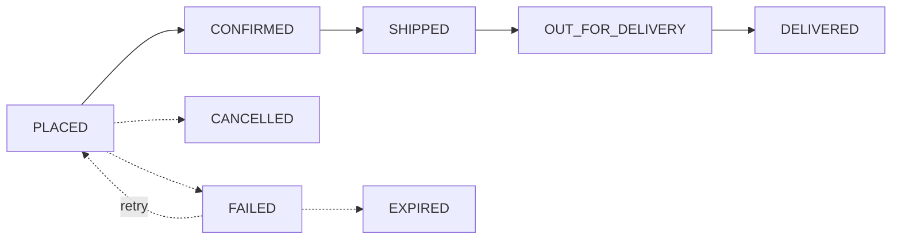
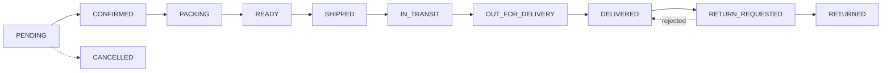

# 🏗️ Architecture & Data Models

Core domain models, their relationships, and the design decisions that power Rex CC.

---

## 🗄️ Domain Models

### 👤 Accounts

| Model | Purpose |
|:---|:---|
| **`CustomUser`** | Email-based auth (`USERNAME_FIELD = "email"`). Auto-generated `referral_code` (`REX-XXXXXX`), `referred_by` self-FK, Cloudinary `avatar`. |
| **`PasswordReset`** | Admin-driven password resets with 10-minute expiry UUID link. |
| **`BlacklistedEmail`** | Stores replaced emails from the email-change flow — prevents re-registration on recycled addresses. |

### 🛍️ Catalog

| Model | Purpose |
|:---|:---|
| **`Brand` & `Category`** | Taxonomies with auto-generated `slug` and `is_active` toggle. |
| **`Product`** | Parent container linked to Brand and Category. Supports draft mode and soft deletion. |
| **`ProductVariant`** | Purchasable SKU with attributes (dial/strap color, material, size), `price`, `discount_rate`, and `stock`. |
| **`InventoryLog`** | Immutable audit trail: `change`, `stock_before/after`, `reason`, `actor`. DB-enforced math validation. |

### 🏷️ Offers & Coupons

| Model | Purpose |
|:---|:---|
| **`Offer`** | Percentage discounts attachable to products, categories, or brands via M2M. Date-range and `is_active` gated. |
| **`Coupon`** | `PERCENTAGE` or `FIXED` discount codes with `usage_limit`, `per_user_limit`, `min_order_amount`, and optional `max_discount_amount` cap. Soft-deletable. |
| **`CouponUsage`** | Tracks each coupon redemption per user per order. |

### 📦 Orders

| Model | Purpose |
|:---|:---|
| **`Order`** | Macro order state: `order_number`, JSON address snapshots, totals, applied coupon, and `cart_snapshot` for Razorpay's two-phase flow. |
| **`OrderItem`** | Line items with individual `quantity`, `price`, and `status`. |
| **`Return`** | Item-level return requests with `reason_code`, `status`, and up to 3 `ReturnImage` uploads. |

### 💳 Payments

| Model | Purpose |
|:---|:---|
| **`Transaction`** | Universal financial ledger. Uses `GenericFK` to link to any source (Order, Return, User). Tracks `gateway_order_id` and `status` (PENDING → PAID). |

> [!NOTE]
> **DB Indexes on `Transaction`:**
> `["user", "-created_at"]`, `["content_type", "object_id"]`, `["transaction_type", "status"]`

### ⭐ Reviews

| Model | Purpose |
|:---|:---|
| **`Review`** | 1–5 star rating with title and comment. One review per user per product (`UniqueConstraint`). Only purchasers with a `DELIVERED` item can review. Soft-delete via `is_active`. |

### 💼 Users (Wallet, Cart, Wishlist)

| Model | Purpose |
|:---|:---|
| **`Address`** | Shipping/billing details with soft-delete and per-user max limits. |
| **`Cart` & `CartItem`** | Transient shopping data. `CartItem` uses `unique_together` on cart + variant. |
| **`Wishlist` & `WishlistItem`** | Per-user product wishlisting linked to `ProductVariant`. |
| **`Wallet`** | Digital ledger for refunds and top-ups. Locked with `select_for_update()` during modifications. |
| **`WalletTransaction`** | Immutable `CREDIT`/`DEBIT` records with `balance_before` and `balance_after` snapshots. |

---

## 🔄 Status State Machines

### Order Flow

### Order Item Flow

---

## 🧠 Core Design Decisions

> [!IMPORTANT]
> Understanding these principles is critical before modifying the codebase.

1. **Universal Transaction Ledger (`GenericFK`)**
   A single `Transaction` model handles every money movement. `GenericForeignKey` links each transaction back to its exact origin instead of fragmenting payment data.

2. **Atomic Wallet Operations (`select_for_update`)**
   Every wallet credit or debit enforces database-level row locking inside an atomic transaction to prevent race conditions.

3. **Two-Phase Cart Snapshots**
   The cart is serialized to `Order.cart_snapshot` *before* opening the Razorpay modal. Stock is deducted and `OrderItems` created *after* the gateway confirms payment.

4. **Database-Enforced Inventory Math**
   Every stock mutation writes to `InventoryLog`. The rule `stock_after == stock_before + change` is enforced at the ORM `clean()` level.

5. **Soft Deletion Over Hard Deletion**
   Products, variants, and coupons use `is_deleted=True` to maintain referential integrity for historical orders.
